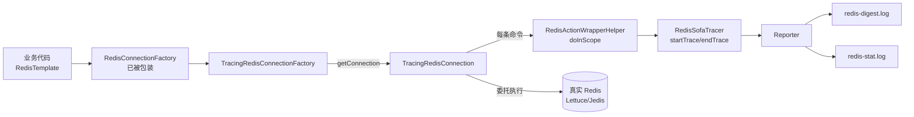
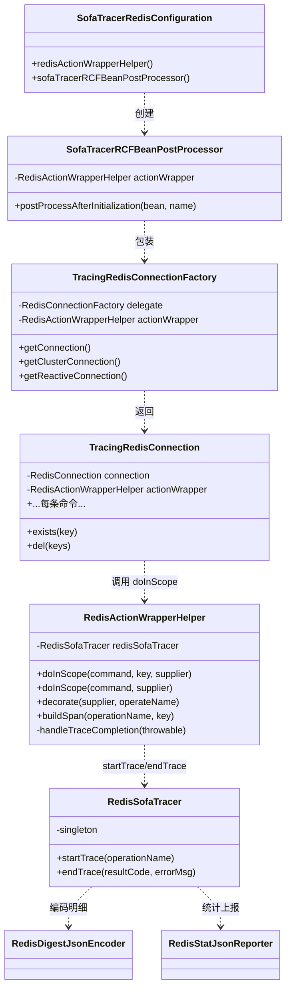
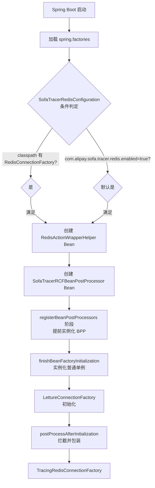
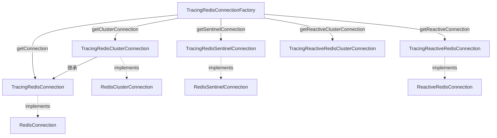
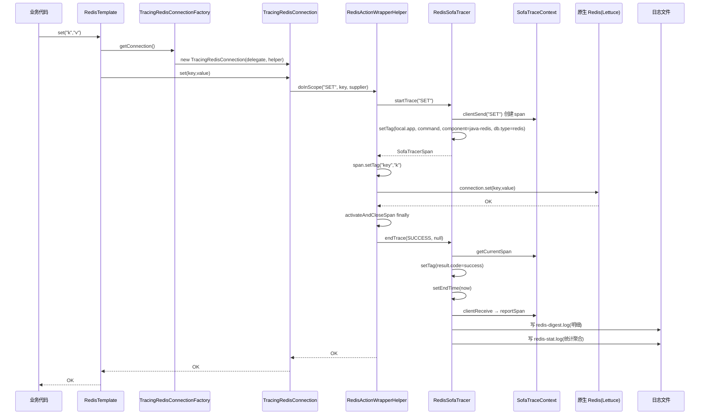
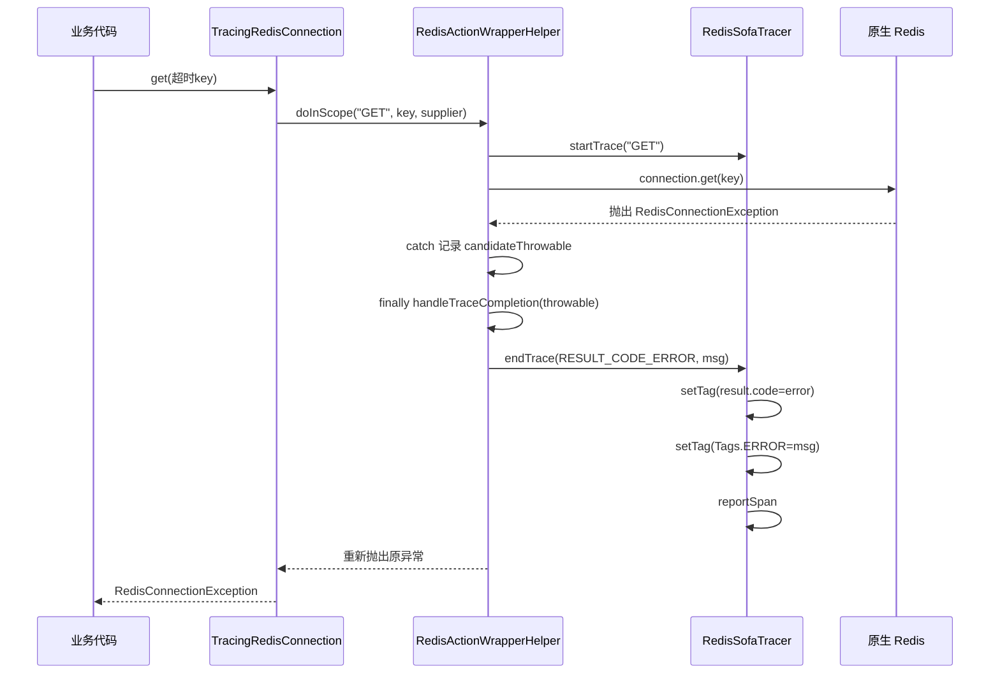
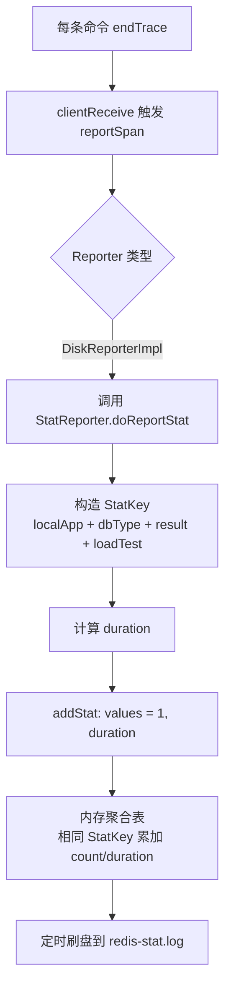
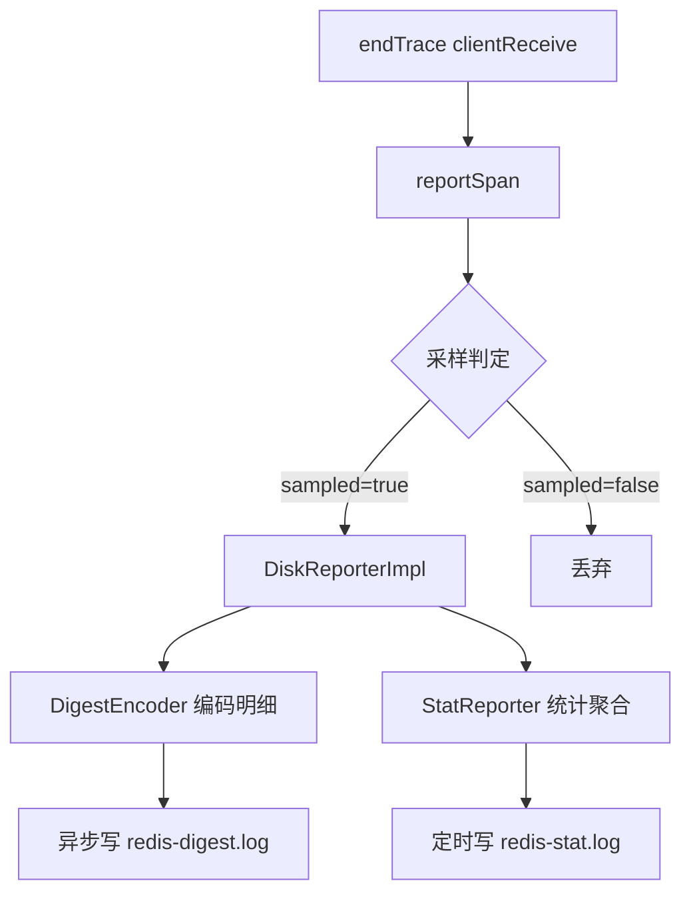

# SOFA Tracer Redis 插件实现原理详解

> 基于 `sofa-tracer-plugins/sofa-tracer-redis-plugin` 与 `tracer-sofa-boot-starter` 的 Spring Boot 集成源码梳理。
> 插件作用：对 Spring Data Redis 的每一条命令进行链路追踪，输出 `redis-digest.log`（明细）和 `redis-stat.log`（统计）。

---

## 一、概述

Redis 插件采用**装饰器 + BeanPostProcessor 后置拦截**的经典套路，对业务代码零侵入。

- **不使用 Agent、不使用 AOP**，而是利用 Spring 的 `BeanPostProcessor` 把容器中所有 `RedisConnectionFactory`（Lettuce / Jedis）偷换成 `TracingRedisConnectionFactory`；
- 再由该装饰器返回被包装的 `TracingRedisConnection`，对每一条 Redis 命令用 `doInScope(...)` 包裹，自动开启/结束 span；
- 组件名 `redis`，`Tags.COMPONENT = "java-redis"`，`Tags.DB_TYPE = "redis"`。

### 整体调用链路一览



---

## 二、模块结构与依赖

Redis 插件与 Spring Boot 集成分属两个模块：

| 模块 | 作用 | 关键类 |
|------|------|--------|
| `sofa-tracer-plugins/sofa-tracer-redis-plugin` | 核心插件（装饰器、Tracer、编码器） | `TracingRedisConnectionFactory`、`RedisSofaTracer`、`RedisActionWrapperHelper` |
| `tracer-sofa-boot-starter` | Spring Boot 自动装配 | `SofaTracerRedisConfiguration`（注册 BeanPostProcessor） |

### 插件依赖（`pom.xml`）

```
tracer-core               （必需，核心）
spring-data-redis         （provided，运行时由使用方提供）
reactor-core              （provided，支持 reactive）
spring-boot-starter-data-redis  （test）
embedded-redis 0.6        （test，内嵌 Redis）
```

`spring-data-redis` 是 `provided`，所以使用方必须自行引入 `spring-boot-starter-data-redis`。

### 包结构（`com.sofa.alipay.tracer.plugins.spring.redis`）

```
├── SofaTracerRCFBeanPostProcessor.java        // BeanPostProcessor：包装 ConnectionFactory
├── TracingRedisConnectionFactory.java          // ConnectionFactory 装饰器
├── common/
│   ├── RedisActionWrapperHelper.java          // 核心：doInScope / buildSpan / decorate
│   ├── RedisCommand.java                      // 命令名常量（DEL/EXISTS/GET/...）
│   ├── Action.java                            // 函数式接口 void execute()
│   ├── ThrowingAction.java                    // 可抛异常的 Action
│   └── ThrowingSupplier.java                  // 可抛异常的 Supplier
├── connections/
│   ├── TracingRedisConnection.java            // 普通连接装饰器
│   ├── TracingRedisClusterConnection.java     // 集群连接装饰器
│   ├── TracingRedisSentinelConnection.java    // 哨兵连接装饰器
│   ├── TracingReactiveRedisConnection.java    // 响应式连接装饰器
│   └── TracingReactiveRedisClusterConnection.java // 响应式集群连接装饰器
├── tracer/
│   └── RedisSofaTracer.java                   // 核心 Tracer（单例）
├── encoder/
│   ├── RedisDigestEncoder.java                // 明细文本编码器
│   └── RedisDigestJsonEncoder.java            // 明细 JSON 编码器
├── reporter/
│   ├── RedisStatReporter.java                 // 统计文本上报器
│   └── RedisStatJsonReporter.java             // 统计 JSON 上报器
└── enums/
    └── RedisLogEnum.java                       // 日志文件名枚举
```

---

## 三、核心类关系图



---

## 四、自动装配流程

入口在 `tracer-sofa-boot-starter`。`spring.factories` 注册了 `SofaTracerRedisConfiguration`：

```
# META-INF/spring.factories
org.springframework.boot.autoconfigure.EnableAutoConfiguration=\
  ...
  com.alipay.sofa.tracer.boot.redis.configuration.SofaTracerRedisConfiguration
```

`SofaTracerRedisConfiguration.java:34` 的装配条件与产物：

```java
@Configuration
@ConditionalOnClass({ RedisConnectionFactory.class, RedisActionWrapperHelper.class })
@ConditionalOnProperty(name = "com.alipay.sofa.tracer.redis.enabled",
                       havingValue = "true", matchIfMissing = true)  // 默认开启
@AutoConfigureAfter(SofaTracerAutoConfiguration.class)
public class SofaTracerRedisConfiguration {

    @Bean @ConditionalOnMissingBean
    RedisActionWrapperHelper redisActionWrapperHelper() {
        return new RedisActionWrapperHelper();          // ① 创建 helper
    }

    @Bean @ConditionalOnMissingBean
    SofaTracerRCFBeanPostProcessor sofaTracerRCFBeanPostProcessor(
            RedisActionWrapperHelper redisActionWrapperHelper) {
        return new SofaTracerRCFBeanPostProcessor(redisActionWrapperHelper);  // ② 创建 BPP
    }
}
```

### 装配流程图



> **关键时序**：`BeanPostProcessor` 在 Spring 刷新流程的 `registerBeanPostProcessors()` 阶段被提前实例化，早于 `finishBeanFactoryInitialization()` 中普通单例（含 `LettuceConnectionFactory`）的创建。因此包装能正确生效。

---

## 五、BeanPostProcessor 包装机制

`SofaTracerRCFBeanPostProcessor.java:37`：

```java
public class SofaTracerRCFBeanPostProcessor implements BeanPostProcessor {

    private final RedisActionWrapperHelper actionWrapper;

    @Override
    public Object postProcessAfterInitialization(Object bean, String beanName) {
        if (bean instanceof RedisConnectionFactory) {
            // 偷梁换柱：用 Tracing 版替换原始 ConnectionFactory
            bean = new TracingRedisConnectionFactory(
                (RedisConnectionFactory) bean, actionWrapper);
        }
        return bean;
    }
}
```

- 只重写 `postProcessAfterInitialization`（在 Bean 初始化完成后包装）；
- 仅对 `RedisConnectionFactory` 类型生效，其它 Bean 原样返回；
- 原始 ConnectionFactory 作为 `delegate` 被持有，后续真实 IO 仍走它。

---

## 六、ConnectionFactory 装饰器

`TracingRedisConnectionFactory.java:42` 同时实现 `RedisConnectionFactory` 和 `ReactiveRedisConnectionFactory`，负责返回**被包装的连接**：

```java
@Override
public RedisConnection getConnection() {
    RedisConnection connection = this.delegate.getConnection();
    if (connection instanceof RedisClusterConnection) {
        return new TracingRedisClusterConnection(
            (RedisClusterConnection) connection, actionWrapper);   // 集群
    }
    return new TracingRedisConnection(connection, actionWrapper);  // 普通
}

@Override
public RedisClusterConnection getClusterConnection() {
    return new TracingRedisClusterConnection(
        delegate.getClusterConnection(), actionWrapper);
}

@Override
public RedisSentinelConnection getSentinelConnection() {
    return new TracingRedisSentinelConnection(
        delegate.getSentinelConnection(), actionWrapper);
}

@Override
public ReactiveRedisConnection getReactiveConnection() {
    // reactive 同理，区分 cluster / 普通
    ...
}
```

### 连接装饰器层级



`TracingRedisClusterConnection` 继承 `TracingRedisConnection` 并额外实现 `RedisClusterConnection`，复用普通命令的拦截逻辑，只补充集群特有命令（`clusterGetNodes` 等）。

---

## 七、命令拦截机制（核心）

每个 Connection 装饰器都把方法委托给原生连接，但在外面包一层 `actionWrapper.doInScope(...)`。

### TracingRedisConnection 中的拦截样例（`TracingRedisConnection.java:189`）

```java
// 通用 execute
public Object execute(String command, byte[]... args) {
    return actionWrapper.doInScope(command, () -> connection.execute(command, args));
}

// 单 key 命令：带 key 用于打 tag
public Boolean exists(byte[] key) {
    return actionWrapper.doInScope(RedisCommand.EXISTS, key, () -> connection.exists(key));
}

// 多 key 命令：带 keys，自动限流 1024 个
public Long del(byte[]... keys) {
    return actionWrapper.doInScope(RedisCommand.DEL, keys, () -> connection.del(keys));
}

// 无 key 命令：仅 command 名
public Set<byte[]> keys(byte[] pattern) {
    return actionWrapper.doInScope(RedisCommand.KEYS, () -> connection.keys(pattern));
}
```

`doInScope` 有多个重载，区别仅在是否把 key/keys 作为 span tag 记录：

| 重载 | 记录的 tag | 适用场景 |
|------|-----------|---------|
| `doInScope(command, key, supplier)` | `key`（单 key 反序列化） | EXISTS / TYPE / EXPIRE 等单 key 命令 |
| `doInScope(command, keys, supplier)` | `keys`（多 key，截断到 1024） | DEL / UNLINK / TOUCH 等多 key 命令 |
| `doInScope(command, supplier)` | 无额外 tag | KEYS / SCAN / RANDOMKEY 等无 key 命令 |
| `doInScope(command, runnable)` | 无额外 tag | void 返回命令 |
| `decorate(supplier, operateName)` | 无额外 tag | 通用包装（同步开/关） |

### RedisActionWrapperHelper 核心逻辑

`RedisActionWrapperHelper.java:34`：

```java
public class RedisActionWrapperHelper {
    protected final SofaTracer    tracer;
    private final RedisSofaTracer redisSofaTracer;

    // 单 key 版
    public <T> T doInScope(String command, byte[] key, Supplier<T> supplier) {
        buildSpan(command, deserialize(key));   // ① 开 span + 打 key tag
        return activateAndCloseSpan(supplier);  // ② 执行 + ③ finally 收尾
    }

    // 多 key 版
    public <T> T doInScope(String command, byte[][] keys, Supplier<T> supplier) {
        SofaTracerSpan span = redisSofaTracer.startTrace(command);
        span.setTag("keys", toStringWithDeserialization(limitKeys(keys)));  // 限流
        return activateAndCloseSpan(supplier);
    }

    // 限流：超过 1024 个 key 截断，防日志爆炸
    <T> T[] limitKeys(T[] keys) {
        if (keys != null && keys.length > 1024) {
            return Arrays.copyOfRange(keys, 0, 1024);
        }
        return keys;
    }

    private <T> T activateAndCloseSpan(Supplier<T> supplier) {
        Throwable candidateThrowable = null;
        try {
            return supplier.get();               // 执行真实命令
        } catch (Throwable t) {
            candidateThrowable = t;
            throw t;
        } finally {
            handleTraceCompletion(candidateThrowable);  // 成功/失败收尾
        }
    }

    private void handleTraceCompletion(Throwable t) {
        if (t != null) {
            redisSofaTracer.endTrace(RESULT_CODE_ERROR, t.getMessage());
        } else {
            redisSofaTracer.endTrace(RESULT_CODE_SUCCESS, null);
        }
    }

    public void buildSpan(String operationName, Object key) {
        SofaTracerSpan span = redisSofaTracer.startTrace(operationName);
        span.setTag("key", nullable(key));
    }
}
```

---

## 八、Span 生命周期时序图

以 `template.opsForValue().set("k","v")` 为例，完整时序：



### 异常路径时序



> 异常时**原异常会被重新抛出**（`throw t`），不会吞掉业务异常；同时 span 已记录 error 信息。

---

## 九、RedisSofaTracer 详解

`RedisSofaTracer.java:42` 是单例 `AbstractClientTracer`：

```java
public class RedisSofaTracer extends AbstractClientTracer {
    public static final String COMMAND        = "command";
    public static final String COMPONENT_NAME = "java-redis";
    public static final String DB_TYPE        = "redis";

    private volatile static RedisSofaTracer redisSofaTracer;  // 双检锁单例

    public static RedisSofaTracer getRedisSofaTracerSingleton() {
        if (redisSofaTracer == null) {
            synchronized (RedisSofaTracer.class) {
                if (redisSofaTracer == null) {
                    redisSofaTracer = new RedisSofaTracer(ComponentNameConstants.REDIS);
                }
            }
        }
        return redisSofaTracer;
    }
```

### startTrace -- 开启 span

`RedisSofaTracer.java:117`：

```java
public SofaTracerSpan startTrace(String operationName) {
    SofaTracerSpan sofaTracerSpan = clientSend(operationName);  // AbstractClientTracer
    if (this.appName == null) {
        this.appName = SofaTracerConfiguration.getProperty(TRACER_APPNAME_KEY);
    }
    SofaTracerSpanContext ctx = sofaTracerSpan.getSofaTracerSpanContext();
    if (ctx != null) {
        sofaTracerSpan.setTag(CommonSpanTags.LOCAL_APP, appName);   // 应用名
        sofaTracerSpan.setTag(COMMAND, operationName);              // 命令名
        sofaTracerSpan.setTag(Tags.COMPONENT.getKey(), COMPONENT_NAME); // java-redis
        sofaTracerSpan.setTag(Tags.DB_TYPE.getKey(), DB_TYPE);      // redis
    }
    return sofaTracerSpan;
}
```

### endTrace -- 结束 span

`RedisSofaTracer.java:133`：

```java
public void endTrace(String resultCode, String errorMsg) {
    SofaTraceContext ctx = SofaTraceContextHolder.getSofaTraceContext();
    SofaTracerSpan span = ctx.getCurrentSpan();
    if (span != null) {
        try {
            span.setTag(CommonSpanTags.RESULT_CODE, resultCode);   // success/error
            if (StringUtils.isNotBlank(errorMsg)) {
                span.setTag(Tags.ERROR.getKey(), errorMsg);        // 异常信息
            }
            span.setEndTime(System.currentTimeMillis());
            clientReceive(resultCode);   // 触发 reportSpan
        } catch (Throwable throwable) {
            SelfLog.errorWithTraceId("redis processed", throwable);
        }
    }
}
```

### Span 上的 tag 汇总

| tag | 来源 | 含义 |
|-----|------|------|
| `local.app` | startTrace | 应用名（spring.application.name） |
| `command` | startTrace | Redis 命令名（GET/SET/DEL...） |
| `component` | startTrace | 固定 `java-redis` |
| `db.type` | startTrace | 固定 `redis` |
| `key` / `keys` | buildSpan / doInScope | 命令操作的 key（反序列化） |
| `result.code` | endTrace | `success` / `error` |
| `error` | endTrace | 异常 message（仅异常时） |
| `traceId`/`spanId`/`time`... | 框架通用 | 由父类统一输出 |

---

## 十、日志输出

### RedisLogEnum（`RedisLogEnum.java:28`）

```java
REDIS_DIGEST("redis_digest_log_name", "redis-digest.log", "redis_digest_rolling"),
REDIS_STAT  ("redis_stat_log_name",   "redis-stat.log",   "redis_stat_rolling");
```

| 文件 | 类型 | 内容 |
|------|------|------|
| `redis-digest.log` | 明细 | 每条命令一条：traceId、spanId、command、key、耗时、result.code、error |
| `redis-stat.log` | 统计 | 按 localApp + dbType + 成功/失败 + 压测标记 聚合：调用次数、总耗时 |

### 明细编码器

#### `RedisDigestJsonEncoder`（`RedisDigestJsonEncoder.java:32`，JSON 版基类）

```java
protected void appendComponentSlot(XStringBuilder xsb, JsonStringBuilder jsb, SofaTracerSpan span) {
    jsb.append(Tags.DB_TYPE.getKey(), tagWithStr.get(Tags.DB_TYPE.getKey()));  // db.type=redis
    jsb.append(CommonSpanTags.METHOD, span.getOperationName());               // command 名
}
```

#### `RedisDigestEncoder`（`RedisDigestEncoder.java:31`，文本版）

```java
protected void appendComponentSlot(XStringBuilder xsb, JsonStringBuilder jsb, SofaTracerSpan span) {
    xsb.append(tagWithStr.get(Tags.DB_TYPE.getKey()));   // redis
    xsb.append(span.getOperationName());                  // 命令名
}
```

> 选择策略：`RedisSofaTracer.getClientDigestEncoder()` 根据 `SofaTracerConfiguration.isJsonOutput()` 返回 JSON 或文本编码器。

### 统计上报器

#### `RedisStatReporter`（`RedisStatReporter.java:33`，文本）

```java
public void doReportStat(SofaTracerSpan span) {
    StatKey statKey = new StatKey();
    statKey.setKey(buildString(localApp, dbType));          // 维度：app+dbType
    statKey.setResult(result==success ? STAT_FLAG_SUCCESS : STAT_FLAG_FAILS);
    statKey.setEnd(buildString(loadTestMark));              // 压测标记
    statKey.setLoadTest(isLoadTest);
    long duration = span.getEndTime() - span.getStartTime();
    long[] values = new long[] { 1, duration };             // [调用次数, 耗时]
    this.addStat(statKey, values);                          // 聚合累加
}
```

#### `RedisStatJsonReporter`（`RedisStatJsonReporter.java:34`，JSON）

逻辑相同，区别是用 `StatMapKey`（具名 key）输出结构化 JSON：

```java
statKey.addKey(CommonSpanTags.LOCAL_APP, localApp);
statKey.addKey(Tags.DB_TYPE.getKey(), dbType);
```

---

## 十一、统计聚合流程



统计维度四元组：`应用名 × db类型(redis) × 成功/失败 × 压测标记`，聚合值 `count + totalDuration`。

---

## 十二、Span 上报流程



---

## 十三、配置项

| 配置项 | 默认值 | 作用 |
|--------|--------|------|
| `com.alipay.sofa.tracer.redis.enabled` | `true` | 是否启用 Redis 追踪（`@ConditionalOnProperty matchIfMissing=true`） |
| `com.alipay.sofa.tracer.jsonOutput` | `false` | 日志输出 JSON（true）或文本（false），影响编码器/上报器选择 |
| `spring.application.name` | - | 写入 `local.app` tag 与统计维度 |
| `redis_digest_log_name` | （天数） | redis-digest.log 保留天数 |
| `redis_stat_log_name` | （天数） | redis-stat.log 保留天数 |
| `redis_digest_rolling` | （策略） | redis-digest.log 滚动策略 |
| `redis_stat_rolling` | （策略） | redis-stat.log 滚动策略 |

---

## 十四、使用方式

### 1. 引入依赖

```xml
<!-- starter 已包含 sofa-tracer-redis-plugin -->
<dependency>
    <groupId>com.alipay.sofa</groupId>
    <artifactId>tracer-sofa-boot-starter</artifactId>
</dependency>
<!-- spring-data-redis 在 starter 中是 optional，使用方须自行引入 -->
<dependency>
    <groupId>org.springframework.boot</groupId>
    <artifactId>spring-boot-starter-data-redis</artifactId>
</dependency>
```

### 2. 配置

```properties
spring.application.name=my-app
spring.redis.host=127.0.0.1
spring.redis.port=6379
com.alipay.sofa.tracer.redis.enabled=true      # 默认开，可省略
com.alipay.sofa.tracer.jsonOutput=true          # JSON 日志
```

### 3. 业务代码零改动

```java
@Autowired
private StringRedisTemplate template;

public void demo() {
    template.opsForValue().set("key", "value");
    String v = template.opsForValue().get("key");
}
```

参考测试 `SofaTracerRedisConnectionTest.java:61`（内嵌 Redis + StringRedisTemplate 验证）。

### 4. 关闭方式

- 全局关闭：`com.alipay.sofa.tracer.redis.enabled=false`

---

## 十五、关键设计点总结

1. **零侵入**：通过 `BeanPostProcessor` 在容器层替换 `RedisConnectionFactory`，业务代码无需任何改动，`RedisTemplate` 自动获得追踪能力。

2. **装饰器而非代理**：`TracingRedisConnection` 直接实现 `RedisConnection` 接口并持有原生连接，对每个方法逐一包装，比动态代理更直观、性能更好。

3. **早注册保证生效**：`BeanPostProcessor` 在 Spring 刷新的 `registerBeanPostProcessors()` 阶段提前实例化，先于普通单例 Bean，因此能拦截到 `LettuceConnectionFactory` 的创建。

4. **命令粒度 span**：每条 Redis 命令一个独立 span，operationName 即命令名，与上层 HTTP/Dubbo span 通过 `clientSend/clientReceive` 自动建立父子关系。

5. **key 限流防爆炸**：多 key 命令（DEL/MGET...）的 key 数量限制在 1024 个（`limitKeys`），避免一条命令记录过多 key 导致日志膨胀。

6. **异常不吞没**：`doInScope` 在 `finally` 中按是否有异常记录 success/error，但 `catch` 里 `throw t` 重新抛出，业务异常正常传播。

7. **双格式输出**：通过 `isJsonOutput()` 在 JSON/文本编码器与上报器间切换，满足不同日志采集需求。

8. **明细+统计双轨**：`redis-digest.log` 提供逐条调用详情用于排障，`redis-stat.log` 提供聚合统计用于监控大盘，两者职责分离。

9. **条件装配**：`@ConditionalOnClass` 确保 classpath 无 Redis 时不触发装配，`@ConditionalOnProperty` 允许按需关闭，对无 Redis 的应用零负担。

10. **覆盖全连接类型**：普通 / 集群 / 哨兵 / 响应式 四类连接均有对应装饰器，且集群连接继承普通连接复用命令拦截逻辑。
