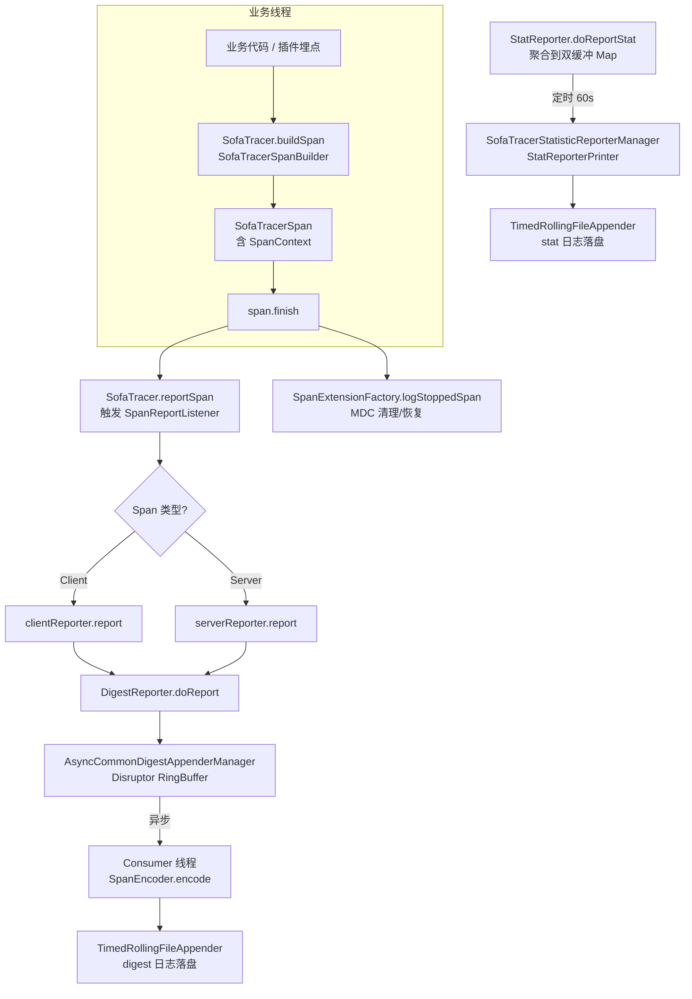
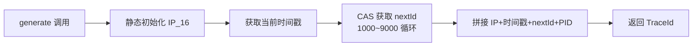
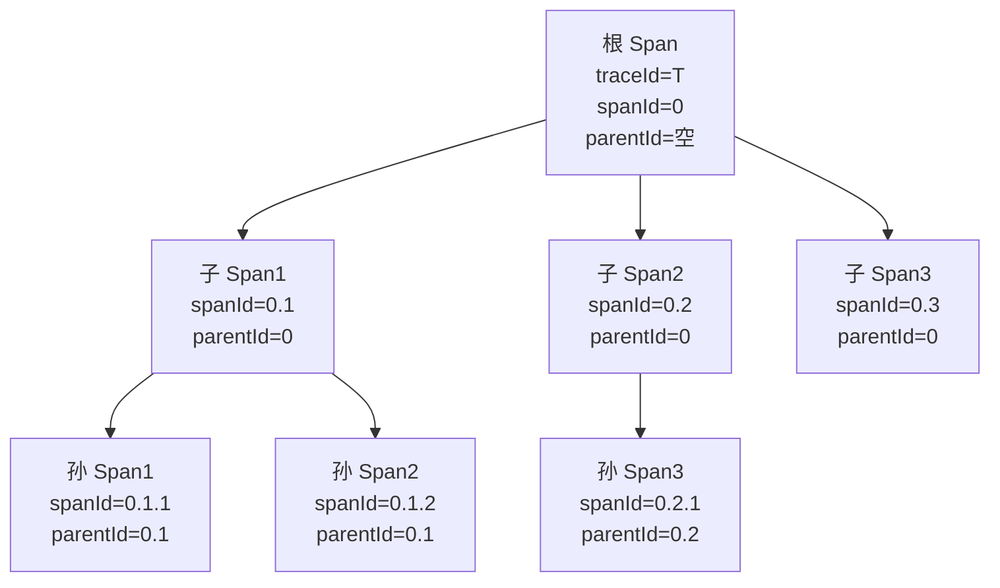
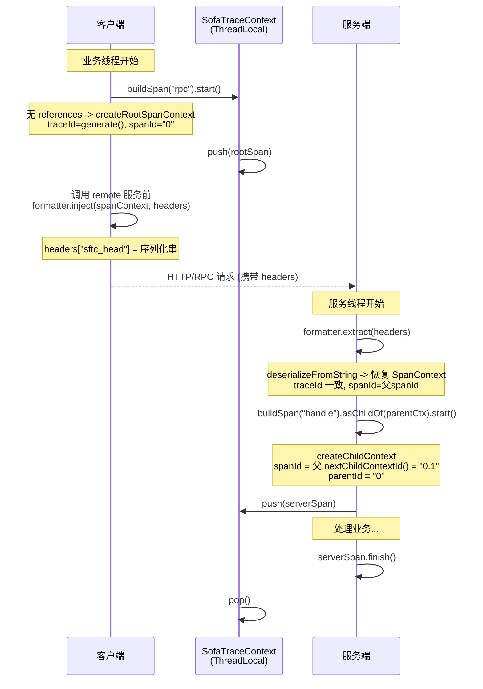
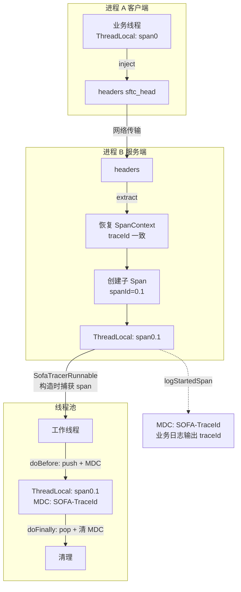
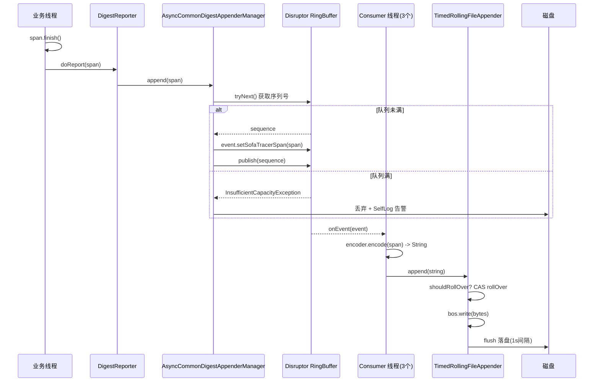
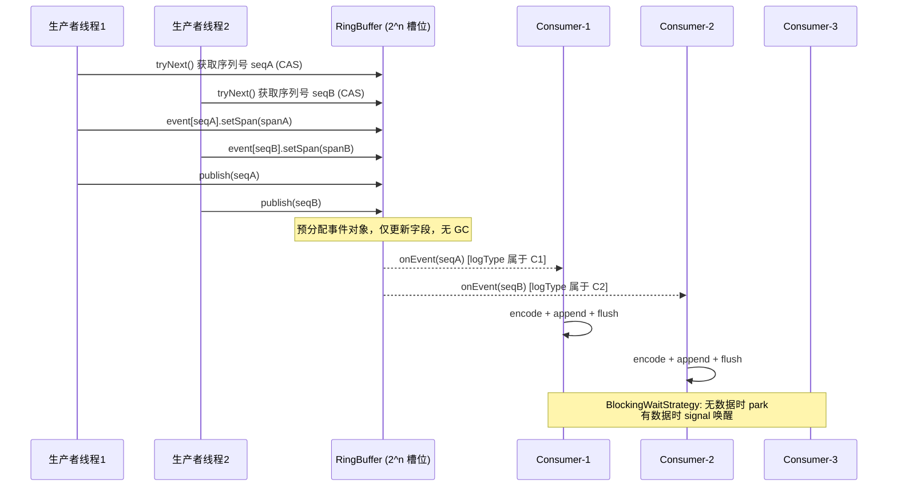
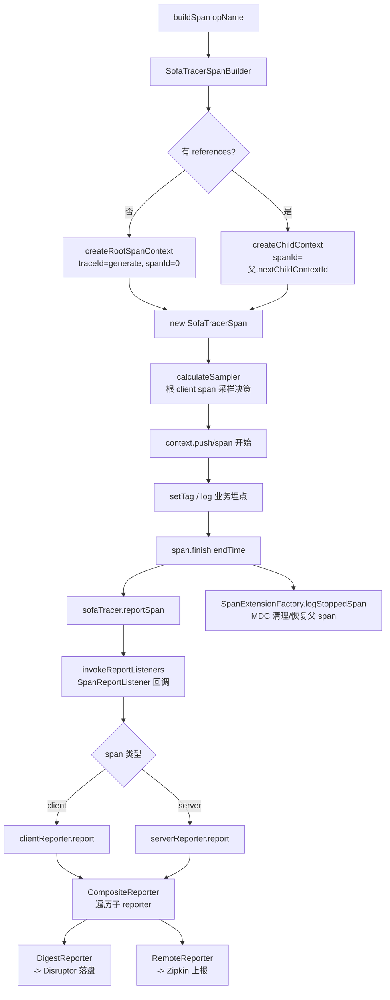
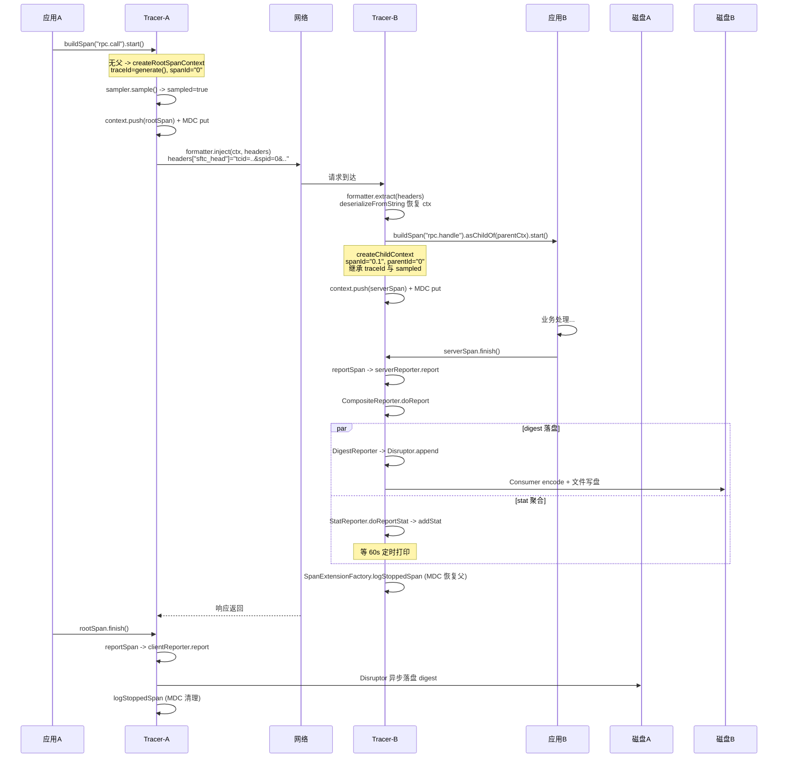

# SOFATracer 实现原理深度源码解析

> 基于 sofa-tracer master 分支源码深入分析。SOFATracer 是蚂蚁金服开源的分布式链路跟踪组件，基于 OpenTracing 规范，通过统一 `traceId` 将分布式调用链路以日志方式记录，实现网络调用透视化。

---

## 目录

- [一、项目总览与核心架构](#一项目总览与核心架构)
- [二、TraceId 生成机制](#二traceid-生成机制)
- [三、父子兄弟 Span 关联机制](#三父子兄弟-span-关联机制)
- [四、TraceId 透传机制](#四traceid-透传机制)
- [五、Digest 摘要日志落盘机制](#五digest-摘要日志落盘机制)
- [六、Stat 统计日志落盘机制](#六stat-统计日志落盘机制)
- [七、Disruptor 高性能队列使用](#七disruptor-高性能队列使用)
- [八、Reporter 体系与扩展机制](#八reporter-体系与扩展机制)
- [九、其他核心原理补充](#九其他核心原理补充)
- [十、端到端总览](#十端到端总览)

---

## 一、项目总览与核心架构

### 1.1 模块划分

| 模块 | 职责 |
|------|------|
| `tracer-core` | 核心库：TraceId/SpanId 生成、Span 上下文、Disruptor 异步落盘、Reporter、采样器、Formatter |
| `tracer-extensions` | 扩展库：基于 SLF4J MDC 的日志透传（`MDCSpanExtension`） |
| `tracer-sofa-boot-starter` | Spring Boot Starter：自动装配、配置监听、健康检查 |
| `tracer-all` | 打包聚合模块 |
| `sofa-tracer-plugins/*` | 各组件插件：SpringMVC / Dubbo / HttpClient / Redis / DataSource / RocketMQ / Kafka / RabbitMQ / OpenFeign / MongoDB / OkHttp / RestTemplate / Flexible 等 |

### 1.2 核心架构



---

## 二、TraceId 生成机制

### 2.1 TraceIdGenerator 源码

文件：`tracer-core/src/main/java/com/alipay/common/tracer/core/generator/TraceIdGenerator.java`

```java
public class TraceIdGenerator {
    private static String        IP_16 = "ffffffff";
    private static AtomicInteger count = new AtomicInteger(1000);

    static {
        try {
            String ipAddress = TracerUtils.getInetAddress();
            if (ipAddress != null) {
                IP_16 = getIP_16(ipAddress);
            }
        } catch (Throwable e) { /* empty */ }
    }

    private static String getTraceId(String ip, long timestamp, int nextId) {
        StringBuilder appender = new StringBuilder(30);
        appender.append(ip).append(timestamp).append(nextId).append(TracerUtils.getPID());
        return appender.toString();
    }

    public static String generate() {
        return getTraceId(IP_16, System.currentTimeMillis(), getNextId());
    }

    private static String getIP_16(String ip) {
        String[] ips = ip.split("\\.");
        StringBuilder sb = new StringBuilder();
        for (String column : ips) {
            String hex = Integer.toHexString(Integer.parseInt(column));
            if (hex.length() == 1) {
                sb.append('0').append(hex);
            } else {
                sb.append(hex);
            }
        }
        return sb.toString();
    }

    private static int getNextId() {
        for (;;) {
            int current = count.get();
            int next = (current > 9000) ? 1000 : current + 1;
            if (count.compareAndSet(current, next)) {
                return next;
            }
        }
    }
}
```

### 2.2 TraceId 格式构成

TraceId 由四段拼接而成（无分隔符）：

```
IP_16(8位)  +  timestamp(13位毫秒)  +  nextId(4位)  +  PID
   c0a80101        1719800000000          1000         12345
```

| 段 | 含义 | 生成方式 |
|----|------|----------|
| IP_16 | 本机 IPv4 的十六进制 | 把 IP 每段转 2 位 hex 拼接，如 `192.168.1.1` -> `c0a80101` |
| timestamp | 当前毫秒时间戳 | `System.currentTimeMillis()` |
| nextId | 进程内自增序号 | `AtomicInteger` 从 1000 起，CAS 递增，超过 9000 回退到 1000 |
| PID | 进程 ID | `TracerUtils.getPID()` |

**唯一性保障**：IP 区分机器、时间戳 + 自增序号区分同机器同进程的并发请求、PID 区分同机器多进程。

### 2.3 生成流程



---

## 三、父子兄弟 Span 关联机制

### 3.1 SofaTracerSpanContext 核心字段

文件：`tracer-core/src/main/java/com/alipay/common/tracer/core/context/span/SofaTracerSpanContext.java:37`

```java
public class SofaTracerSpanContext implements SpanContext {
    public static final String RPC_ID_SEPARATOR = ".";

    private String  traceId;
    private String  spanId;
    private String  parentId;
    private boolean isSampled = true;

    // 子上下文计数器，原子递增，用于生成子 spanId
    private AtomicInteger childContextIndex = new AtomicInteger(0);

    // 系统维度透传数据（_sys_ 前缀）
    private final Map<String, String> sysBaggage = new ConcurrentHashMap<>();
    // 业务维度透传数据
    private final Map<String, String> bizBaggage = new ConcurrentHashMap<>();
}
```

### 3.2 SpanId 层级生成

根 Span 的 spanId 固定为 `"0"`（`SofaTracer.ROOT_SPAN_ID`）。子 spanId 通过 `nextChildContextId()` 生成：

```java
// SofaTracerSpanContext.java:399
public String nextChildContextId() {
    return this.spanId + RPC_ID_SEPARATOR + childContextIndex.incrementAndGet();
}
```

每次调用 `incrementAndGet()`，序号递增，从而为同一父节点下的兄弟 Span 分配唯一序号。

### 3.3 ParentId 自动推导

```java
// SofaTracerSpanContext.java:316
private String genParentSpanId(String spanId) {
    return (StringUtils.isBlank(spanId) || spanId.lastIndexOf(RPC_ID_SEPARATOR) < 0)
        ? StringUtils.EMPTY_STRING
        : spanId.substring(0, spanId.lastIndexOf(RPC_ID_SEPARATOR));
}
```

无需手动指定 parentId，直接从 spanId 截取最后一个 `.` 之前的部分。例如 spanId=`0.1.2`，则 parentId=`0.1`。

### 3.4 父子兄弟 Span 树形结构示例



- **父子关系**：父 Span 调用 `nextChildContextId()` 生成子 spanId，子 spanId 前缀就是父 spanId。
- **兄弟关系**：共享同一父 Span 的 `childContextIndex`，依次递增得到 `0.1`、`0.2`、`0.3`。
- **同一 traceId**：整条链路共享根 Span 创建时生成的 traceId。

### 3.5 ThreadLocal Span 栈

文件：`tracer-core/src/main/java/com/alipay/common/tracer/core/context/trace/SofaTracerThreadLocalTraceContext.java`

```java
public class SofaTracerThreadLocalTraceContext implements SofaTraceContext {
    private final ThreadLocal<SofaTracerSpan> threadLocal = new ThreadLocal<>();

    @Override
    public void push(SofaTracerSpan span) {
        threadLocal.set(span);  // 替换为当前活跃 Span
    }

    @Override
    public SofaTracerSpan getCurrentSpan() {
        return threadLocal.get();  // 不修改栈结构
    }

    @Override
    public SofaTracerSpan pop() {
        SofaTracerSpan span = threadLocal.get();
        clear();
        return span;
    }

    @Override
    public void clear() {
        threadLocal.remove();
    }
}
```

单元素栈设计：每个线程同一时刻只持有一个活跃 Span，`push` 覆盖、`pop` 取出并清除。

`SofaTraceContextHolder` 提供全局单例访问：

```java
private static final SofaTraceContext SOFA_TRACE_CONTEXT = new SofaTracerThreadLocalTraceContext();
public static SofaTraceContext getSofaTraceContext() { return SOFA_TRACE_CONTEXT; }
```

### 3.6 SpanBuilder 创建根/子上下文

文件：`tracer-core/src/main/java/com/alipay/common/tracer/core/SofaTracer.java`（内部类 `SofaTracerSpanBuilder`）

```java
// 无 references：创建根 Span
private SofaTracerSpanContext createRootSpanContext() {
    String traceId = TraceIdGenerator.generate();   // 生成新 traceId
    return new SofaTracerSpanContext(traceId, ROOT_SPAN_ID, StringUtils.EMPTY_STRING);
}

// 有 references：创建子 Span
private SofaTracerSpanContext createChildContext() {
    SofaTracerSpanContext preferredReference = preferredReference();
    SofaTracerSpanContext child = new SofaTracerSpanContext(
        preferredReference.getTraceId(),               // 继承父 traceId
        preferredReference.nextChildContextId(),        // 生成子 spanId
        preferredReference.getSpanId(),                 // 父 spanId 作为 parentId
        preferredReference.isSampled());                // 继承采样状态
    child.addBizBaggage(this.createChildBaggage(true));
    child.addSysBaggage(this.createChildBaggage(false));
    return child;
}
```

### 3.7 SofaTracerSpan 的父引用

`SofaTracerSpan` 持有 `parentSofaTracerSpan` 字段，建立内存层面的直接引用，便于：
- 上报时获取完整上下文
- 层级超过 `MAX_LAYER`（默认 64）时降级为根 Span，防止内存泄漏

### 3.8 跨进程关联：Formatter 注入与提取

文件：`tracer-core/src/main/java/com/alipay/common/tracer/core/registry/AbstractTextFormatter.java`

```java
@Override
public SofaTracerSpanContext extract(TextMap carrier) {
    for (Map.Entry<String, String> entry : carrier) {
        String key = entry.getKey();
        String value = entry.getValue();
        if (FORMATER_KEY_HEAD.equalsIgnoreCase(key) && !StringUtils.isBlank(value)) {
            // key = "sftc_head"
            return SofaTracerSpanContext.deserializeFromString(this.decodedValue(value));
        }
    }
    return null;
}

@Override
public void inject(SofaTracerSpanContext spanContext, TextMap carrier) {
    carrier.put(FORMATER_KEY_HEAD,
        this.encodedValue(spanContext.serializeSpanContext()));
}
```

- 透传 key 为 `sftc_head`（`RegistryExtractorInjector.FORMATER_KEY_HEAD`）
- `HttpHeadersFormatter` 使用 URL 编解码；`TextMapFormatter` 直接使用原值
- B3 格式（`HttpHeadersB3Formatter`）使用 `X-B3-TraceId` / `X-B3-SpanId` / `X-B3-ParentSpanId` / `X-B3-Sampled`

### 3.9 Span 创建与关联时序



---

## 四、TraceId 透传机制

### 4.1 跨进程透传：序列化格式

文件：`SofaTracerSpanContext.java:209`

```java
public String serializeSpanContext() {
    StringBuilder sb = new StringBuilder();
    sb.append("tcid").append("=").append(traceId).append("&");
    sb.append("spid").append("=").append(spanId).append("&");
    sb.append("pspid").append("=").append(parentId).append("&");
    sb.append("sample").append("=").append(isSampled).append("&");
    if (this.sysBaggage.size() > 0) {
        sb.append(StringUtils.mapToStringWithPrefix(this.sysBaggage, "_sys_"));
    }
    if (this.bizBaggage.size() > 0) {
        sb.append(StringUtils.mapToString(bizBaggage));
    }
    return sb.toString();
}
```

**序列化字符串格式**：

```
tcid=<traceId>&spid=<spanId>&pspid=<parentId>&sample=<true|false>&[_sys_xxx=yyy&][bizKey=bizVal&]
```

反序列化 `deserializeFromString`（`:237`）通过 `StringUtils.stringToMap` 解析为 Map，再按 key 还原 traceId/spanId/parentId/sample/sysBaggage（`_sys_` 前缀）/bizBaggage。

### 4.2 跨线程透传：SofaTracerRunnable

文件：`tracer-core/src/main/java/com/alipay/common/tracer/core/async/SofaTracerRunnable.java`

```java
public class SofaTracerRunnable implements Runnable {
    private Runnable wrappedRunnable;
    protected FunctionalAsyncSupport functionalAsyncSupport;

    public SofaTracerRunnable(Runnable wrappedRunnable) {
        // 构造时（提交线程）捕获当前 SofaTraceContext
        this.initRunnable(wrappedRunnable, SofaTraceContextHolder.getSofaTraceContext());
    }

    @Override
    public void run() {
        functionalAsyncSupport.doBefore();   // 工作线程：恢复上下文
        try {
            wrappedRunnable.run();
        } finally {
            functionalAsyncSupport.doFinally();  // 工作线程：清理上下文
        }
    }
}
```

### 4.3 FunctionalAsyncSupport 上下文捕获与恢复

文件：`tracer-core/src/main/java/com/alipay/common/tracer/core/async/FunctionalAsyncSupport.java`

```java
public class FunctionalAsyncSupport {
    private final long tid = Thread.currentThread().getId();   // 捕获提交线程 tid
    protected final SofaTraceContext traceContext;
    private final SofaTracerSpan currentSpan;                    // 捕获当前 Span

    public FunctionalAsyncSupport(SofaTraceContext traceContext) {
        this.traceContext = traceContext;
        this.currentSpan = traceContext.isEmpty() ? null : traceContext.getCurrentSpan();
    }

    public void doBefore() {
        // 跨线程才恢复（同线程不重复 push）
        if (Thread.currentThread().getId() != tid && currentSpan != null) {
            traceContext.push(currentSpan);
            SpanExtensionFactory.logStartedSpan(currentSpan);   // 恢复 MDC
        }
    }

    public void doFinally() {
        if (Thread.currentThread().getId() != tid && currentSpan != null) {
            SofaTracerSpan popped = traceContext.pop();
            SpanExtensionFactory.logStoppedSpan(popped);   // 清理 MDC
        }
    }
}
```

同类设计还有 `SofaTracerCallable`、`TracedExecutorService`（包装线程池，自动包装提交的任务）、`TracerScheduleExecutorService`（包装定时线程池），以及覆盖 JDK8 函数式接口的 `SofaTracerFunction`、`SofaTracerConsumer`、`SofaTracerSupplier` 等。

### 4.4 基于 SLF4J MDC 的透传

文件：`tracer-extensions/src/main/java/com/alipay/common/tracer/extensions/log/MDCSpanExtension.java`

MDC key 常量（`MDCKeyConstants`）：

```java
public static final String MDC_TRACEID      = "SOFA-TraceId";
public static final String MDC_SPANID       = "SOFA-SpanId";
public static final String MDC_PARENTSPANID = "SOFA-ParentSpanId";
```

```java
@Override
public void logStartedSpan(Span currentSpan) {
    SofaTracerSpanContext ctx = ((SofaTracerSpan) currentSpan).getSofaTracerSpanContext();
    if (ctx != null) {
        MDC.put(MDCKeyConstants.MDC_TRACEID, ctx.getTraceId());
        MDC.put(MDCKeyConstants.MDC_SPANID, ctx.getSpanId());
    }
}

@Override
public void logStoppedSpan(Span currentSpan) {
    MDC.remove(MDCKeyConstants.MDC_TRACEID);
    MDC.remove(MDCKeyConstants.MDC_SPANID);
    // 恢复父 Span 的 MDC（如果有），保证嵌套调用的日志链路
    if (currentSpan != null) {
        SofaTracerSpan parent = ((SofaTracerSpan) currentSpan).getParentSofaTracerSpan();
        if (parent != null) {
            SofaTracerSpanContext ctx = parent.getSofaTracerSpanContext();
            if (ctx != null) {
                MDC.put(MDCKeyConstants.MDC_TRACEID, ctx.getTraceId());
                MDC.put(MDCKeyConstants.MDC_SPANID, ctx.getSpanId());
            }
        }
    }
}
```

通过 SPI 机制自动加载（见 8.3），用户在 logback/log4j2 配置中引用 `%X{SOFA-TraceId}` 即可让业务日志带上 traceId。

### 4.5 透传全景



---

## 五、Digest 摘要日志落盘机制

Digest 日志：**每一次调用都落盘**，记录完整调用明细。

### 5.1 日志根目录

文件：`tracer-core/src/main/java/com/alipay/common/tracer/core/appender/TracerLogRootDaemon.java:56`

```java
static {
    String loggingRoot = System.getProperty("SOFA_TRACER_LOGGING_PATH");
    if (StringUtils.isBlank(loggingRoot)) {
        loggingRoot = System.getenv("SOFA_TRACER_LOGGING_PATH");
    }
    if (StringUtils.isBlank(loggingRoot)) {
        loggingRoot = System.getProperty("loggingRoot");
    }
    if (StringUtils.isBlank(loggingRoot)) {
        loggingRoot = System.getProperty("logging.path");
    }
    if (StringUtils.isBlank(loggingRoot)) {
        loggingRoot = System.getProperty("logging.file.path");  // springboot 2.4.x 适配
    }
    if (StringUtils.isBlank(loggingRoot)) {
        loggingRoot = System.getProperty("user.home") + File.separator + "logs";
    }
    String tempLogFileDir = loggingRoot + File.separator + "tracelog";
    if (appendPidToLogPath) {
        tempLogFileDir = tempLogFileDir + File.separator + TracerUtils.getPID();
    }
    LOG_FILE_DIR = tempLogFileDir;
    TracerDaemon.start();   // 启动日志清理守护线程
}
```

**目录解析优先级**：`SOFA_TRACER_LOGGING_PATH`(系统属性) > 同名环境变量 > `loggingRoot` > `logging.path` > `logging.file.path` > `user.home/logs`，最后统一追加 `tracelog` 子目录。

### 5.2 AsyncCommonDigestAppenderManager：Disruptor 异步落盘核心

文件：`tracer-core/src/main/java/com/alipay/common/tracer/core/appender/manager/AsyncCommonDigestAppenderManager.java`

```java
public class AsyncCommonDigestAppenderManager {
    private final Map<String, TraceAppender> appenders = new ConcurrentHashMap<>();
    private final Map<String, SpanEncoder>   contextEncoders = new ConcurrentHashMap<>();

    private Disruptor<SofaTracerSpanEvent>  disruptor;
    private RingBuffer<SofaTracerSpanEvent> ringBuffer;
    private List<Consumer> consumers;
    private AtomicInteger index = new AtomicInteger(0);
    private static final int DEFAULT_CONSUMER_NUMBER = 3;

    public AsyncCommonDigestAppenderManager(int queueSize, int consumerNumber) {
        // 关键：把 queueSize 向上取整为 2 的幂
        int realQueueSize = 1 << (32 - Integer.numberOfLeadingZeros(queueSize - 1));
        disruptor = new Disruptor<>(
            new SofaTracerSpanEventFactory(),   // 事件工厂
            realQueueSize,
            threadFactory,
            ProducerType.MULTI,                 // 多生产者
            new BlockingWaitStrategy());        // 阻塞等待
        this.consumers = new ArrayList<>(consumerNumber);
        for (int i = 0; i < consumerNumber; i++) {
            Consumer consumer = new Consumer();
            consumers.add(consumer);
            disruptor.setDefaultExceptionHandler(new ConsumerExceptionHandler());
            disruptor.handleEventsWith(consumer);   // 注册消费者
        }
        // 丢弃策略配置 ...
    }
}
```

### 5.3 注册 Appender 与 Encoder（按 logType 轮询分配消费者）

```java
public void addAppender(String logType, TraceAppender appender, SpanEncoder encoder) {
    if (isAppenderOrEncoderExist(logType)) {
        SynchronizingSelfLog.error("logType[" + logType + "] already is added ...");
        return;
    }
    appenders.put(logType, appender);
    contextEncoders.put(logType, encoder);
    // 轮询把 logType 分配给某个 consumer，避免单消费者瓶颈
    consumers.get(index.incrementAndGet() % consumers.size()).addLogType(logType);
}
```

### 5.4 生产者：append 把 Span 放入 RingBuffer

```java
public boolean append(SofaTracerSpan sofaTracerSpan) {
    long sequence = 0L;
    if (allowDiscard) {
        try {
            sequence = ringBuffer.tryNext();   // 非阻塞获取序列号
        } catch (InsufficientCapacityException e) {
            // 队列满：丢弃并告警
            if (isOutDiscardId) {
                SofaTracerSpanContext ctx = sofaTracerSpan.getSofaTracerSpanContext();
                if (ctx != null) {
                    SynchronizingSelfLog.warn("discarded tracer: traceId["
                        + ctx.getTraceId() + "];spanId[" + ctx.getSpanId() + "]");
                }
            }
            if (isOutDiscardNumber && discardCount.incrementAndGet() == discardOutThreshold) {
                discardCount.set(0);
                SynchronizingSelfLog.warn("discarded " + discardOutThreshold + " logs");
            }
            return false;
        }
    } else {
        sequence = ringBuffer.next();          // 阻塞获取
    }
    try {
        SofaTracerSpanEvent event = ringBuffer.get(sequence);
        event.setSofaTracerSpan(sofaTracerSpan);   // 填充事件
    } catch (Exception e) {
        SynchronizingSelfLog.error("fail to add event");
        return false;
    }
    ringBuffer.publish(sequence);                  // 发布
    return true;
}
```

### 5.5 消费者：编码并写盘

```java
private class Consumer implements EventHandler<SofaTracerSpanEvent> {
    protected Set<String> logTypes = Collections.synchronizedSet(new HashSet<>());

    @Override
    public void onEvent(SofaTracerSpanEvent event, long sequence, boolean endOfBatch) {
        SofaTracerSpan sofaTracerSpan = event.getSofaTracerSpan();
        if (sofaTracerSpan != null) {
            try {
                String logType = sofaTracerSpan.getLogType();
                if (logTypes.contains(logType)) {
                    SpanEncoder encoder = contextEncoders.get(logType);
                    TraceAppender appender = appenders.get(logType);
                    String encodedStr = encoder.encode(sofaTracerSpan);   // Span -> 字符串
                    if (appender instanceof LoadTestAwareAppender) {
                        // 压测日志分流
                        ((LoadTestAwareAppender) appender).append(encodedStr,
                            TracerUtils.isLoadTest(sofaTracerSpan));
                    } else {
                        appender.append(encodedStr);
                    }
                    appender.flush();
                    event.clear();   // 释放引用，便于 GC
                }
            } catch (Exception e) {
                // 异常记录到 SelfLog，带 traceId/spanId
            }
        }
    }
}
```

### 5.6 Span 编码：AbstractDigestSpanEncoder

文件：`tracer-core/src/main/java/com/alipay/common/tracer/core/middleware/parent/AbstractDigestSpanEncoder.java`

```java
@Override
public String encode(SofaTracerSpan span) throws IOException {
    if ("false".equalsIgnoreCase(SofaTracerConfiguration
        .getProperty(SofaTracerConfiguration.JSON_FORMAT_OUTPUT))) {
        return encodeXsbSpan(span);   // 逗号分隔文本
    } else {
        return encodeJsbSpan(span);   // JSON
    }
}

private String encodeXsbSpan(SofaTracerSpan span) {
    XStringBuilder xsb = new XStringBuilder();
    appendXsbCommonSlot(xsb, span);     // 公共字段
    appendComponentSlot(xsb, null, span);   // 组件特有字段（子类实现）
    xsb.append(baggageSystemSerialized(span.getSofaTracerSpanContext()));  // sys baggage
    xsb.appendEnd(baggageSerialized(span.getSofaTracerSpanContext()));     // biz baggage + 换行
    return xsb.toString();
}

protected void appendXsbCommonSlot(XStringBuilder xsb, SofaTracerSpan span) {
    SofaTracerSpanContext context = span.getSofaTracerSpanContext();
    Map<String, String> tags = span.getTagsWithStr();
    xsb.append(Timestamp.format(span.getEndTime()));       // 时间
    xsb.append(tags.get(CommonSpanTags.LOCAL_APP));        // 应用名
    xsb.append(context.getTraceId());                       // TraceId
    xsb.append(context.getSpanId());                        // SpanId
    xsb.append(tags.get(Tags.SPAN_KIND.getKey()));          // span kind
    xsb.append(tags.get(CommonSpanTags.RESULT_CODE));       // 结果码
    xsb.append(tags.get(CommonSpanTags.CURRENT_THREAD_NAME));  // 线程名
    xsb.append((span.getEndTime() - span.getStartTime()) + "ms");  // 耗时
}
```

### 5.7 XStringBuilder 字符串构造器

文件：`tracer-core/src/main/java/com/alipay/common/tracer/core/appender/builder/XStringBuilder.java`

- 默认分隔符 `,`，转义为 `%2C`
- `append` 末尾加分隔符；`appendEnd` 末尾加换行符 `\n`
- `appendEscape`：把字段中的分隔符替换为转义字符，避免解析错乱
- 提供静态复用的 `buffer` / `jsonBuffer`（在 stat 中复用，见 6.5）

### 5.8 文件滚动：TimedRollingFileAppender

文件：`tracer-core/src/main/java/com/alipay/common/tracer/core/appender/file/TimedRollingFileAppender.java`

```java
public static final String DAILY_ROLLING_PATTERN  = "'.'yyyy-MM-dd";      // 按天
public static final String HOURLY_ROLLING_PATTERN = "'.'yyyy-MM-dd_HH";   // 按小时

@Override
public boolean shouldRollOverNow() {
    long n = System.currentTimeMillis();
    if (n >= nextCheck) {
        now.setTime(n);
        nextCheck = rc.getNextCheckMillis(now);   // 计算下次检查时间
        return true;
    }
    return false;
}

@Override
public void rollOver() {
    String datedFilename = fileName + sdf.format(now);
    if (scheduledFilename.equals(datedFilename)) return;
    bos.close();
    File target = new File(scheduledFilename);
    if (target.exists()) target.delete();
    logFile.renameTo(target);        // 当前文件重命名为带日期的归档文件
    this.setFile(false);             // 创建新文件
    scheduledFilename = datedFilename;
}
```

`RollingCalendar.getNextCheckDate` 根据周期类型（秒/分/时/半天/天/周/月）计算下一次滚动时间。

### 5.9 AbstractRollingFileAppender：append 与 flush

文件：`tracer-core/src/main/java/com/alipay/common/tracer/core/appender/file/AbstractRollingFileAppender.java`

```java
private static final long LOG_FLUSH_INTERVAL = TimeUnit.SECONDS.toMillis(1);  // 1秒刷新
public static final int  DEFAULT_BUFFER_SIZE = 8 * 1024;                       // 8KB 缓冲
private final AtomicBoolean isRolling = new AtomicBoolean(false);

@Override
public void append(String log) throws IOException {
    if (bos != null) {
        waitUntilRollFinish();   // 等待其他线程完成滚动
        if (shouldRollOverNow() && isRolling.compareAndSet(false, true)) {
            // CAS 保证只有一个线程执行滚动
            try {
                rollOver();
                nextFlushTime = System.currentTimeMillis() + LOG_FLUSH_INTERVAL;
            } finally {
                isRolling.set(false);
            }
        } else {
            // 超过 1 秒未刷新则 flush
            long now;
            if ((now = System.currentTimeMillis()) >= nextFlushTime) {
                flush();
                nextFlushTime = now + LOG_FLUSH_INTERVAL;
            }
        }
        byte[] bytes = log.getBytes(TracerLogRootDaemon.DEFAULT_CHARSET);
        bos.write(bytes);   // 写入缓冲
    }
}
```

**关键设计**：
- `AtomicBoolean isRolling` + CAS 保证滚动串行化，避免并发滚动
- `waitUntilRollFinish` 自旋等待滚动完成
- IOException 限频打印（60s 一次）避免日志风暴

### 5.10 Digest 落盘全流程



---

## 六、Stat 统计日志落盘机制

Stat 日志：**按周期（默认 60s）聚合统计后落盘**，记录次数、总耗时等聚合指标。

### 6.1 与 digest 的区别

| 维度 | Digest 摘要日志 | Stat 统计日志 |
|------|----------------|---------------|
| 落盘时机 | 每次调用都落盘 | 周期性聚合后落盘（默认 60s） |
| 数据粒度 | 单次调用明细 | 聚合统计（次数、总耗时、成功失败） |
| 异步通道 | Disruptor RingBuffer（AsyncCommonDigestAppenderManager） | 定时调度（ScheduledExecutorService）+ 直接 append |
| 写盘方式 | Span -> encode -> Disruptor -> Consumer -> 文件 | StatValues CAS 累加 -> 定时 print -> 文件 |

### 6.2 AbstractSofaTracerStatisticReporter：双缓冲滚动数组

文件：`tracer-core/src/main/java/com/alipay/common/tracer/core/reporter/stat/AbstractSofaTracerStatisticReporter.java`

```java
public abstract class AbstractSofaTracerStatisticReporter implements SofaTracerStatisticReporter {
    public static final int DEFAULT_CYCLE = 0;
    private static final ReentrantLock initLock = new ReentrantLock(false);

    private long periodTime;        // 周期（秒），默认 60
    private int  printCycle = 0;
    private long countCycle  = 0;   // 当前统计周期计数

    // 双缓冲：两套 Map 交替用于"统计"和"打印"
    private Map<StatKey, StatValues>[] statDatasPair = new ConcurrentHashMap[2];
    private int currentIndex = 0;
    protected Map<StatKey, StatValues> statDatas;   // 当前正在写入的 Map
```

### 6.3 addStat：统计数据聚合

```java
protected void addStat(StatKey keys, long... values) {
    StatValues oldValues = statDatas.get(keys);
    if (oldValues == null) {
        initLock.lock();                    // 双重检查锁初始化 slot
        try {
            oldValues = statDatas.get(keys);
            if (null == oldValues) {
                oldValues = new StatValues(values);
                statDatas.put(keys, oldValues);
                return;
            }
        } finally {
            initLock.unlock();
        }
    }
    if (oldValues != null) {
        oldValues.update(values);           // CAS 累加
    }
}
```

### 6.4 StatValues：CAS 无锁累加

文件：`tracer-core/src/main/java/com/alipay/common/tracer/core/reporter/stat/model/StatValues.java`

```java
public class StatValues {
    private final AtomicReference<long[]> values = new AtomicReference<>();

    public void update(long[] update) {
        long[] current;
        long[] tmp = new long[update.length];
        do {
            current = values.get();
            for (int k = 0; k < update.length && k < current.length; k++) {
                tmp[k] = current[k] + update[k];   // 累加
            }
        } while (!values.compareAndSet(current, tmp));   // CAS 重试
    }

    public void clear(long[] toBeClear) {
        long[] current;
        long[] tmp = new long[toBeClear.length];
        do {
            current = values.get();
            for (int k = 0; k < current.length && k < toBeClear.length; k++) {
                tmp[k] = current[k] - toBeClear[k];   // 扣除已打印
            }
        } while (!values.compareAndSet(current, tmp));
    }

    public long[] getCurrentValue() {
        return values.get();   // 返回引用，永不变（修改即替换整个数组）
    }
}
```

**核心思想**：所有更新都通过 CAS 替换整个数组引用，从不原地修改数组元素，因此 `getCurrentValue` 返回的快照永远是一个不可变的稳定值。

### 6.5 定时调度：SofaTracerStatisticReporterManager

文件：`tracer-core/src/main/java/com/alipay/common/tracer/core/reporter/stat/manager/SofaTracerStatisticReporterManager.java`

```java
public class SofaTracerStatisticReporterManager {
    public static int  CLEAR_STAT_KEY_THRESHOLD = 5000;
    public static final long DEFAULT_CYCLE_SECONDS = 60;
    private Map<String, SofaTracerStatisticReporter> statReporters = new ConcurrentHashMap<>();
    private long cycleTime;
    private ScheduledExecutorService executor;

    SofaTracerStatisticReporterManager(final long cycleTime) {
        this.cycleTime = cycleTime;
        this.executor = Executors.newSingleThreadScheduledExecutor(r -> {
            Thread t = new Thread(r, "Tracer-TimedAppender-"
                + THREAD_NUMBER.incrementAndGet() + "-" + cycleTime);
            t.setDaemon(true);
            return t;
        });
        start();
    }

    private void start() {
        long initialDelay = 0L;
        // 可选：补齐到整分钟开始
        if ("true".equals(SofaTracerConfiguration.getProperty(
            SofaTracerConfiguration.FILL_MINUTE_SWITCH))) {
            initialDelay = DateUtils.diffNextMinute(new Date());
        }
        executor.scheduleAtFixedRate(new StatReporterPrinter(),
            initialDelay, cycleTime * 1000, TimeUnit.MILLISECONDS);
    }
```

### 6.6 StatReporterPrinter：周期打印

```java
class StatReporterPrinter implements Runnable {
    @Override
    public void run() {
        for (SofaTracerStatisticReporter statTracer : statReporters.values()) {
            if (statTracer.shouldPrintNow()) {
                // 切换双缓冲：返回上一周期数据，currentIndex 翻转
                Map<StatKey, StatValues> statDatas = statTracer.shiftCurrentIndex();
                for (Map.Entry<StatKey, StatValues> e : statDatas.entrySet()) {
                    long[] tobePrint = e.getValue().getCurrentValue();
                    if (tobePrint[0] > 0) {                    // 次数>0 才打印
                        statTracer.print(e.getKey(), tobePrint);
                    }
                    e.getValue().clear(tobePrint);             // 扣除已打印值
                }
                // key 数量超阈值则清空，防止变量参数导致内存膨胀
                if (statDatas.size() > CLEAR_STAT_KEY_THRESHOLD) {
                    statDatas.clear();
                }
            }
        }
    }
}
```

**shiftCurrentIndex** 实现双缓冲翻转：

```java
public Map<StatKey, StatValues> shiftCurrentIndex() {
    Map<StatKey, StatValues> last = statDatasPair[currentIndex];
    currentIndex = 1 - currentIndex;            // 0<->1 翻转
    statDatas = statDatasPair[currentIndex];    // 新的写入 Map
    return last;                                // 旧的读取 Map
}
```

### 6.7 stat 日志输出格式

```java
protected void printXsbStat(StatKey statKey, long[] values) {
    buffer.reset();
    buffer.append(Timestamp.currentTime()).append(statKey.getKey());
    for (int i = 0; i < values.length - 1; i++) buffer.append(values[i]);
    buffer.append(values[values.length - 1]);
    buffer.append(statKey.getResult());
    buffer.appendEnd(statKey.getEnd());
    // LoadTestAwareAppender 区分压测
    appender.append(buffer.toString());
    appender.flush();
}
```

JSON 格式输出 `time`、`stat_key`、`count`、`total.cost.milliseconds`、`success`、`load.test` 等字段。

### 6.8 注册与周期管理：SofaTracerStatisticReporterCycleTimesManager

文件：`tracer-core/src/main/java/com/alipay/common/tracer/core/reporter/stat/manager/SofaTracerStatisticReporterCycleTimesManager.java`

```java
private final static Map<Long, SofaTracerStatisticReporterManager> cycleTimesManager
    = new ConcurrentHashMap<>();

public static void registerStatReporter(SofaTracerStatisticReporter reporter) {
    SofaTracerStatisticReporterManager mgr =
        getSofaTracerStatisticReporterManager(reporter.getPeriodTime());
    if (mgr != null) mgr.addStatReporter(reporter);
}
```

每个周期（秒）对应一个 `SofaTracerStatisticReporterManager` 实例，相同周期的 reporter 共用一个定时任务，避免为每个 reporter 各起一个调度线程。

### 6.9 Stat 落盘全流程

```mermaid
flowchart TB
    subgraph 业务线程
        A[span.finish] --> B[StatReporter.doReportStat]
        B --> C[addStat: key, count, cost]
        C --> D{slot 存在?}
        D -->|否| E[initLock 双重检查<br/>新建 StatValues]
        D -->|是| F[StatValues.update<br/>CAS 累加]
    end
    subgraph 定时线程[SofaTracerStatisticReporterManager<br/>内部 ScheduledExecutorService<br/>线程名 Tracer-TimedAppender-N-60 60s 周期]
        G[StatReporterPrinter.run<br/>scheduleAtFixedRate 触发] --> H{shouldPrintNow?}
        H -->|是| I[shiftCurrentIndex<br/>双缓冲翻转]
        I --> J[遍历 statReporters.values<br/>逐个 reporter 处理]
        J --> K{count > 0?}
        K -->|是| L[print: XStringBuilder/JsonStringBuilder]
        L --> M[StatValues.clear<br/>扣除已打印]
        K -->|否| N[跳过]
        M --> O{key > 5000?}
        O -->|是| P[clear 防内存膨胀]
    end
    L --> Q[TimedRollingFileAppender.append<br/>stat 日志落盘]
```



---

## 七、Disruptor 高性能队列使用

SOFATracer 使用了 `com.alipay.disruptor`（LMAX Disruptor 的蚂蚁 repackage 版）实现高性能异步日志落盘。

### 7.1 两个异步管理器对比

| 管理器 | 事件类型 | 默认消费者数 | 用途 |
|--------|----------|-------------|------|
| `AsyncCommonDigestAppenderManager` | `SofaTracerSpanEvent`（Span 对象） | 3 | digest 日志异步落盘 |
| `AsyncCommonAppenderManager` | `StringEvent`（字符串） | 1 | SelfLog 自身日志异步落盘 |

### 7.2 RingBuffer 大小计算

```java
int realQueueSize = 1 << (32 - Integer.numberOfLeadingZeros(queueSize - 1));
```

`Integer.numberOfLeadingZeros(queueSize - 1)` 计算前导零个数，`32 - 该值` 得到有效位数，`1 << n` 向上取整为 2 的幂。Disruptor RingBuffer **必须是 2 的幂**，以支持用位运算（`sequence & (size - 1)`）替代取模定位槽位。

### 7.3 EventFactory 预分配

文件：`SofaTracerSpanEventFactory.java`

```java
public class SofaTracerSpanEventFactory implements EventFactory<SofaTracerSpanEvent> {
    @Override
    public SofaTracerSpanEvent newInstance() {
        return new SofaTracerSpanEvent();
    }
}
```

```java
public class SofaTracerSpanEvent implements ObjectEvent {
    private volatile SofaTracerSpan sofaTracerSpan;
    public void clear() { setSofaTracerSpan(null); }
}
```

Disruptor 启动时通过 EventFactory **一次性预分配整个 RingBuffer 的事件对象**，后续生产者只更新对象字段（`setSofaTracerSpan`）而非创建新对象，**避免 GC 压力**，这是 Disruptor 高性能的核心机制之一。

### 7.4 生产者模式与等待策略

```java
new Disruptor<>(
    new SofaTracerSpanEventFactory(),
    realQueueSize,
    threadFactory,
    ProducerType.MULTI,            // 多生产者（业务线程并发写入）
    new BlockingWaitStrategy());  // 阻塞等待（基于 LockSupport.park）
```

- **`ProducerType.MULTI`**：支持多线程并发发布事件，使用 CAS 保证序列号正确性
- **`BlockingWaitStrategy`**：消费者无数据时阻塞（`LockSupport.park`），有数据时通过 `Condition.signal` 唤醒。相比 `YieldingWaitStrategy`/`SleepingWaitStrategy`，CPU 占用更低，适合日志落盘这种对延迟不极端敏感的场景

### 7.5 消费者：EventHandler 实现

```java
private class Consumer implements EventHandler<SofaTracerSpanEvent> {
    protected Set<String> logTypes = Collections.synchronizedSet(new HashSet<>());
    @Override
    public void onEvent(SofaTracerSpanEvent event, long sequence, boolean endOfBatch) { ... }
}
```

- 每个 Consumer 维护自己负责的 `logTypes` 集合，通过 `addAppender` 时的 `index.incrementAndGet() % consumers.size()` **轮询分配**
- `onEvent` 按 `span.getLogType()` 路由到对应 encoder + appender

### 7.6 异常处理：ExceptionHandler

文件：`ConsumerExceptionHandler.java`

```java
public class ConsumerExceptionHandler implements ExceptionHandler<SofaTracerSpanEvent> {
    @Override
    public void handleEventException(Throwable ex, long sequence, SofaTracerSpanEvent event) {
        // onEvent 抛异常时调用，记录到 SelfLog
    }
    @Override
    public void handleOnStartException(Throwable ex) { /* 启动异常 */ }
    @Override
    public void handleOnShutdownException(Throwable ex) { /* 关闭异常 */ }
}
```

通过 `disruptor.setDefaultExceptionHandler(new ConsumerExceptionHandler())` 注册，保证消费异常不会中断 Disruptor 整体运行。

### 7.7 队列满丢弃策略

```java
private boolean      allowDiscard;
private boolean      isOutDiscardNumber;
private boolean      isOutDiscardId;
private long         discardOutThreshold;
private PaddedAtomicLong discardCount;
```

| 配置项 | 默认值 | 含义 |
|--------|--------|------|
| `tracer_async_appender_allow_discard` | true | 是否开启丢弃策略 |
| `tracer_async_appender_is_out_discard_number` | true | 是否输出丢弃数量告警 |
| `tracer_async_appender_is_out_discard_id` | false | 是否输出丢弃的 traceId/spanId |
| `tracer_async_appender_discard_out_threshold` | 500 | 累计丢弃阈值，达到后打印一次告警 |

开启丢弃时用 `ringBuffer.tryNext()` 非阻塞获取，失败立即丢弃；否则用 `ringBuffer.next()` 阻塞等待。

### 7.8 PaddedAtomicLong：避免伪共享

```java
class PaddedAtomicLong extends AtomicLong {
    public volatile long p1, p2, p3, p4, p5, p6 = 7L;  // 填充
    public PaddedAtomicLong(long initialValue) { super(initialValue); }
}
```

CPU 缓存行通常 64 字节，`AtomicLong` 内部只有一个 long 值。多线程高频修改时，不同线程的 AtomicLong 可能落在同一缓存行，导致缓存行频繁失效（伪共享 false sharing）。通过 6 个 volatile long 填充，把 `discardCount` 独占一个缓存行，避免伪共享，提升并发性能。

### 7.9 ConsumerThreadFactory：线程命名

```java
public class ConsumerThreadFactory implements ThreadFactory {
    private String workName;
    @Override
    public Thread newThread(Runnable runnable) {
        Thread worker = new Thread(runnable, "Tracer-AsyncConsumer-Thread-" + workName);
        worker.setDaemon(true);   // 守护线程，JVM 退出不阻塞
        return worker;
    }
}
```

digest 的 workerName 为 `"NetworkAppender"`（见 8.2），所以线程名为 `Tracer-AsyncConsumer-Thread-NetworkAppender`。

### 7.10 Disruptor 数据流



### 7.11 相比 BlockingQueue 的优势

| 维度 | ArrayBlockingQueue | Disruptor |
|------|-------------------|-----------|
| 内存分配 | 每次入队可能创建对象 | 启动预分配，运行期零分配 |
| 锁机制 | `ReentrantLock` 互斥 | CAS 无锁（多生产者）/ 序列号 |
| 伪共享 | 存在 | `PaddedAtomicLong` 填充避免 |
| 槽位定位 | 取模运算 | 位运算（`seq & (size-1)`） |
| 队列满 | 阻塞/丢弃 | `tryNext` 非阻塞丢弃 |

---

## 八、Reporter 体系与扩展机制

### 8.1 Reporter 接口

```java
public interface Reporter {
    String getReporterType();
    void   report(SofaTracerSpan span);
    void   close();
    // 常量
    String REMOTE_REPORTER  = "REMOTE_REPORTER";
    String COMPOSITE_REPORTER = "COMPOSITE_REPORTER";
}
```

### 8.2 SofaTracerDigestReporterAsyncManager：单例管理

文件：`tracer-core/src/main/java/com/alipay/common/tracer/core/reporter/digest/manager/SofaTracerDigestReporterAsyncManager.java`

```java
private static volatile AsyncCommonDigestAppenderManager asyncCommonDigestAppenderManager;

public static AsyncCommonDigestAppenderManager getSofaTracerDigestReporterAsyncManager() {
    if (asyncCommonDigestAppenderManager == null) {
        synchronized (SofaTracerDigestReporterAsyncManager.class) {
            if (asyncCommonDigestAppenderManager == null) {     // 双重检查锁
                AsyncCommonDigestAppenderManager localManager =
                    new AsyncCommonDigestAppenderManager(1024);  // 队列 1024
                localManager.start("NetworkAppender");            // 启动 Disruptor
                asyncCommonDigestAppenderManager = localManager;
            }
        }
    }
    return asyncCommonDigestAppenderManager;
}
```

### 8.3 组合 Reporter：SofaTracerCompositeDigestReporterImpl

```java
public class SofaTracerCompositeDigestReporterImpl extends AbstractReporter {
    private ConcurrentHashMap<String, Reporter> compositedReporters = new ConcurrentHashMap<>();

    @Override
    public void doReport(SofaTracerSpan span) {
        for (Map.Entry<String, Reporter> entry : compositedReporters.entrySet()) {
            entry.getValue().report(span);   // 遍历所有子 reporter 逐个上报
        }
    }

    public void addReporter(Reporter reporter) {
        if (!compositedReporters.containsKey(reporter.getReporterType())) {
            compositedReporters.put(reporter.getReporterType(), reporter);
        }
    }
}
```

组合模式允许同时把 Span 上报给多个目的地（如本地 digest + 远程 Zipkin）。

### 8.4 Client/Server Reporter 区分

在 `SofaTracer.reportSpan` 中按 Span 类型分流：

```java
protected void reportSpan(SofaTracerSpan span) {
    invokeReportListeners(span);   // 先触发 SpanReportListener
    // 对根客户端 Span 应用采样策略
    if (sampler != null && span.isClient() && span.getParentSofaTracerSpan() == null) {
        span.getSofaTracerSpanContext().setSampled(sampler.sample(span).isSampled());
    }
    if (span.isClient() || FLEXIBLE 类型) {
        if (this.clientReporter != null) this.clientReporter.report(span);
    } else if (span.isServer()) {
        if (this.serverReporter != null) this.serverReporter.report(span);
    }
}
```

- **ClientReporter**：处理客户端 Span（发起远程调用）
- **ServerReporter**：处理服务端 Span（接收请求）

### 8.5 SofaTracerSpan.finish 完整流程

文件：`tracer-core/src/main/java/com/alipay/common/tracer/core/span/SofaTracerSpan.java`

```java
@Override
public void finish() {
    this.finish(System.currentTimeMillis());
}

@Override
public void finish(long endTime) {
    this.setEndTime(endTime);                       // 1. 记录结束时间
    this.sofaTracer.reportSpan(this);                // 2. 上报 Span（触发 listener + reporter）
    SpanExtensionFactory.logStoppedSpan(this);      // 3. 扩展回调（清理/恢复 MDC）
}
```

### 8.6 SpanExtension：SPI 扩展机制

文件：`tracer-core/src/main/java/com/alipay/common/tracer/core/extensions/SpanExtensionFactory.java`

```java
static {
    for (SpanExtension spanExtension : ServiceLoader.load(SpanExtension.class)) {
        spanExtensions.add(spanExtension);   // Java SPI 自动加载
    }
}

public static void logStartedSpan(Span currentSpan) {
    for (SpanExtension extension : spanExtensions) {
        extension.logStartedSpan(currentSpan);
    }
}
```

`SpanExtension` 接口提供四个扩展点：`logStartedSpan`、`logStoppedSpan`、`logStoppedSpanInRunnable`、`supportName`。`MDCSpanExtension`（`supportName="slf4jmdc"`）就是通过 `META-INF/services/com.alipay.common.tracer.core.extensions.SpanExtension` 注册并自动加载的。

### 8.7 SpanReportListener 监听器

文件：`tracer-core/src/main/java/com/alipay/common/tracer/core/listener/SpanReportListenerHolder.java`

```java
private static final List<SpanReportListener> spanReportListenersHolder = new CopyOnWriteArrayList<>();

protected void invokeReportListeners(SofaTracerSpan span) {
    List<SpanReportListener> listeners = SpanReportListenerHolder.getSpanReportListenersHolder();
    if (listeners != null) {
        for (SpanReportListener listener : listeners) {
            listener.onSpanReport(span);   // 在 reporter.report 之前回调
        }
    }
}
```

用户可注册自定义 `SpanReportListener` 在 Span 上报前做额外处理（如监控指标上报、敏感数据脱敏），`CopyOnWriteArrayList` 保证遍历安全。

### 8.8 Span 生命周期总览



---

## 九、其他核心原理补充

### 9.1 采样器 Sampler

接口：

```java
public interface Sampler {
    SamplingStatus sample(SofaTracerSpan sofaTracerSpan);
    String getType();
    void close();
}
```

**SofaTracerPercentageBasedSampler**（百分比采样，默认实现）：

```java
public class SofaTracerPercentageBasedSampler implements Sampler {
    public static final String TYPE = "PercentageBasedSampler";
    private final AtomicLong counter = new AtomicLong(0);
    private final BitSet sampleDecisions;
    private final SamplerProperties configuration;

    public SofaTracerPercentageBasedSampler(SamplerProperties configuration) {
        int outOf100 = (int) configuration.getPercentage();
        // 启动时随机生成 100 位 BitSet，其中 outOf100 个为 true
        this.sampleDecisions = randomBitSet(100, outOf100, new Random());
        this.configuration = configuration;
    }

    @Override
    public SamplingStatus sample(SofaTracerSpan sofaTracerSpan) {
        if (this.configuration.getPercentage() == 0) return 不采样;
        if (this.configuration.getPercentage() == 100) return 全采样;
        // counter 取模 100，从预生成的 BitSet 取决策
        boolean result = this.sampleDecisions.get((int) (this.counter.getAndIncrement() % 100));
        samplingStatus.setSampled(result);
        return samplingStatus;
    }
}
```

**采样决策流程**：
- 仅对**根客户端 Span**采样（`span.isClient() && parentSofaTracerSpan == null`）
- 子 Span 直接继承父 Span 的采样状态（`preferredReference.isSampled()`）
- 启动时用 `BitSet` 预生成 100 次决策，避免每次随机数开销，保证采样分布均匀
- 支持自定义采样器（通过配置全类名 + `SamplerFactory.getSampler()`）

### 9.2 日志滚动与自动清理

`TracerDaemon` 在 `TracerLogRootDaemon` 静态初始化时启动守护线程，周期性调用各 Appender 的 `cleanup()`：

```java
// TimedRollingFileAppender.cleanup()
File[] logFiles = parentDirectory.listFiles((dir, name) ->
    name.startsWith(baseName));   // 找到所有归档日志
for (File logFile : logFiles) {
    Date date = parse(logFileName 后缀);   // 按天/按小时解析
    Calendar expire = now - logReserveConfig.getDay() days - hour hours;
    if (logCal.before(expire)) logFile.delete();   // 删除过期日志
}
```

- 保留天数由 `tracer_global_log_reserve_day` 配置（默认 7 天）
- 滚动策略由 `tracer_global_rolling_key` 配置（`DAILY_ROLLING_PATTERN` / `HOURLY_ROLLING_PATTERN`）

### 9.3 压测日志隔离：LoadTestAwareAppender

```java
public class LoadTestAwareAppender implements TraceAppender {
    private TraceAppender nonLoadTestTraceAppender;  // 正常日志
    private TraceAppender loadTestTraceAppender;     // 压测日志（shadow/ 目录）

    public void append(String log, boolean loadTest) throws IOException {
        if (loadTest) {
            loadTestTraceAppender.append(log);    // 写入 shadow/ 子目录
        } else {
            nonLoadTestTraceAppender.append(log);
        }
    }

    public static LoadTestAwareAppender createLoadTestAwareTimedRollingFileAppender(String logName, boolean append) {
        TraceAppender normal = new TimedRollingFileAppender(logName, append);
        TraceAppender shadow = new TimedRollingFileAppender("shadow" + File.separator + logName, append);
        return new LoadTestAwareAppender(normal, shadow);
    }
}
```

通过 `TracerUtils.isLoadTest(span)` 判断压测标记，压测流量日志单独写到 `shadow/` 子目录，与正常流量物理隔离。

### 9.4 SelfLog 自身日志

SOFATracer 自身的运行日志（如丢弃告警、异常）通过 `SelfLog` / `SynchronizingSelfLog` 输出，避免与业务 digest 日志混淆。`SynchronizingSelfLog` 是同步写盘（保证可靠性），`AsyncCommonAppenderManager`（1 个消费者）专门用于 SelfLog 异步落盘。

### 9.5 StaticInfoLog 静态信息日志

启动时输出应用静态信息（IP、PID、应用名等）到 `static-info.log`，便于排查问题。

### 9.6 配置体系：SofaTracerConfiguration

`SofaTracerConfiguration` 持有全局配置，支持运行时动态修改（通过 `tracer-sofa-boot-starter` 的 `SofaTracerPropertyListener` 监听配置变更）。关键配置：

| 配置项 | 含义 |
|--------|------|
| `stat_log_interval` | stat 日志输出周期（秒） |
| `json_format_output` | 日志是否输出 JSON 格式 |
| `tracer_async_appender_allow_discard` | 是否允许丢弃 |
| `tracer_global_log_reserve_day` | 日志保留天数 |
| `tracer_global_rolling_key` | 滚动策略 |
| `fill_minute_switch` | stat 是否补齐到整分钟 |

### 9.7 Baggage 透传数据脱敏

`AbstractDigestSpanEncoder.baggageSerialized` 调用 `DesensitizationHelper.desensitize()` 对透传数据脱敏，避免敏感信息落盘。系统 baggage 使用 `_sys_` 前缀与业务 baggage 区分。

---

## 十、端到端总览

### 10.1 一次完整 RPC 调用的全链路



### 10.2 核心机制总结

| 机制 | 实现要点 |
|------|---------|
| TraceId 唯一性 | IP16 + 毫秒时间戳 + AtomicInteger(1000~9000) + PID |
| Span 父子关联 | `nextChildContextId()`：父spanId + "." + 原子自增序号 |
| Span 兄弟关联 | 共享父 `childContextIndex`，依次递增 |
| ParentId 推导 | 从 spanId 截取最后一个 `.` 之前部分 |
| 跨进程透传 | `sftc_head` key + `tcid&spid&pspid&sample` 序列化串 |
| 跨线程透传 | `FunctionalAsyncSupport` 构造捕获 + doBefore/doFinally push/pop |
| MDC 日志透传 | `MDCSpanExtension` SPI 注入 SOFA-TraceId/SOFA-SpanId |
| Digest 异步落盘 | Disruptor RingBuffer(1024) + 3 Consumer + 编码 + 滚动文件 |
| Stat 聚合落盘 | 双缓冲 Map + CAS StatValues + 60s 定时打印 |
| 高性能 | Disruptor 预分配无 GC + CAS 无锁 + PaddedAtomicLong 防伪共享 |
| 采样 | BitSet 预生成决策 + 根 Span 决策 + 子 Span 继承 |
| 日志滚动 | AtomicBoolean CAS 串行化 + RollingCalendar 计算周期 |
| 压测隔离 | LoadTestAwareAppender 分流到 shadow/ 目录 |
| 扩展性 | SpanExtension SPI + SpanReportListener CopyOnWriteArrayList + 组合 Reporter |

---

> 本文档基于 sofa-tracer master 分支源码深度分析整理，涵盖核心模块 `tracer-core` 与 `tracer-extensions` 的关键实现。各插件模块（`sofa-tracer-plugins/*`）基于上述核心能力，在具体组件埋点处完成 Span 的创建、inject/extract 与 reporter 注册。